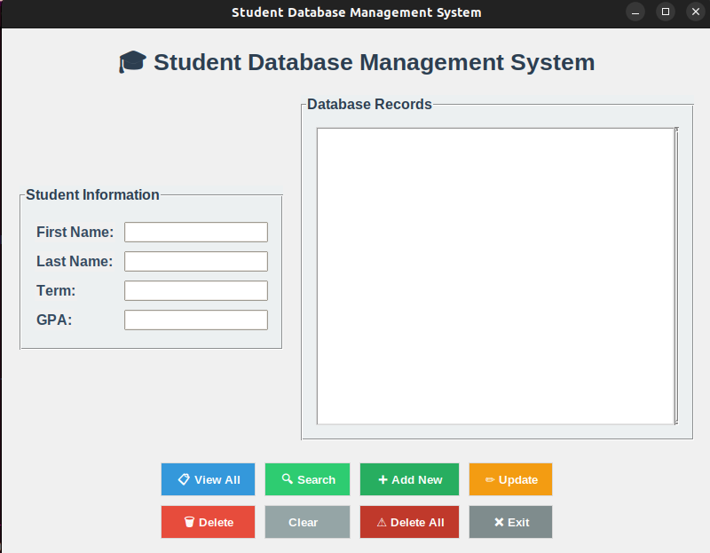
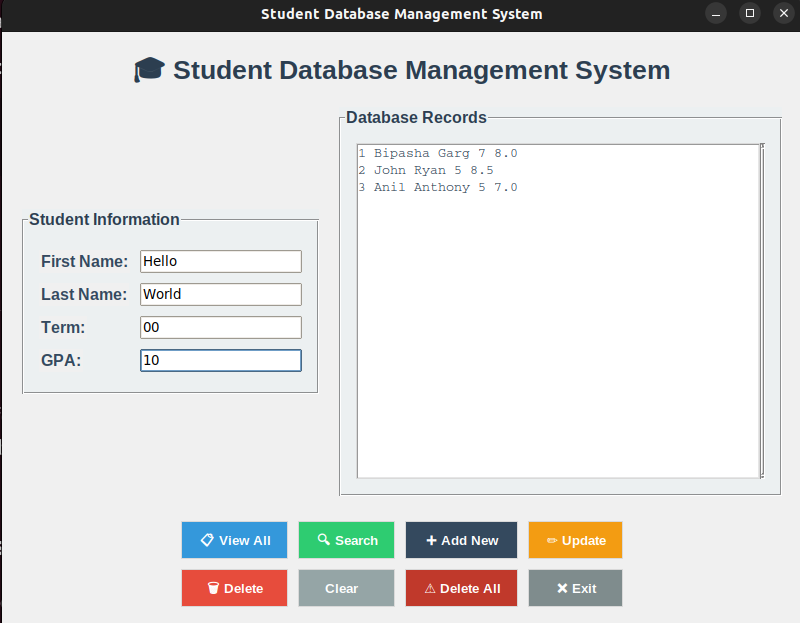

# Student Database Management System

A modern, user-friendly desktop application for managing student records with an intuitive GUI built using Python's Tkinter library and SQLite database.

## Features

- **Add New Students**: Insert student records with first name, last name, term, and GPA
- **View All Records**: Display all students in the database
- **Search Functionality**: Search students by any field (name, term, or GPA)
- **Update Records**: Modify existing student information
- **Delete Records**: Remove individual student records
- **Clear Database**: Clear all student records at once from the display


## UI

<p align="center">
  
</p>


The application features a modern interface with:
- Clean, organized and an intuitive layout with labeled sections
- Color-coded buttons for different actions

## Requirements

- Python 3.x
- tkinter (included with Python)
- sqlite3 (included with Python)

## Project Structure

```
student-database/
│
├── frontend.py          # Main GUI application
├── backend.py           # Database operations
├── Students.db          # SQLite database (created automatically)
└── README.md           # This file
```

## Installation & Setup

1. **Clone or download** the project files
2. **Ensure Python 3.x is installed** on your system
3. **No additional packages needed** - uses only Python standard library

## How to Run

1. **Make sure both files are in the same directory**:
   - `frontend.py` (the GUI)
   - `backend.py` (database operations)

2. **Run the application**:
   ```bash
   python frontend.py
   ```

3. **The application will start** and create the database automatically if it doesn't exist

## How to Use

### Adding a Student
1. Fill in the student information in the input fields
2. Click the "Add New" button
3. The student will be added and displayed in the database list

### Viewing All Students
- Click "View All" to see all students in the database

### Searching for Students
1. Enter search criteria in any of the input fields
2. Click "Search" to find matching students
3. Leave fields empty to search all records

### Updating a Student
1. Click on a student record in the list to select it
2. The information will populate in the input fields
3. Modify the information as needed
4. Click "Update" to save changes

### Deleting a Student
1. Select a student from the list
2. Click "Delete" to remove the selected student

### Other Functions
- **Clear**: Clear the input fields and list display
- **Delete All**: Remove all students from the database
- **Exit**: Close the application


<p align="center">
  
</p>


## Database Schema

The application uses SQLite with the following table structure:

```sql
CREATE TABLE data1 (
    id INTEGER PRIMARY KEY,
    fn TEXT,           -- First Name
    ln TEXT,           -- Last Name  
    term INTEGER,      -- Term
    gpa REAL          -- GPA
);
```

## 🔧 Technical Details

### Frontend (`frontend.py`)
- Built with Python's Tkinter library
- Uses ttk for modern styling
- Custom color scheme and typography

### Backend (`backend.py`)
- SQLite database operations
- CRUD functionality (Create, Read, Update, Delete)
- Automatic database creation
- Safe SQL queries using parameterized statements

### Key Functions

**Backend Functions:**
- `connect()`: Initialize database and create table
- `insert()`: Add new student record
- `view()`: Retrieve all students
- `search()`: Find students by criteria
- `update()`: Modify existing records
- `delete()`: Remove specific student
- `delete_data()`: Clear entire database

**Frontend Functions:**
- `get_selected_row()`: Handle list selection
- `view_command()`: Display all records
- `search_command()`: Search functionality
- `add_command()`: Add new student
- `update_command()`: Update selected student
- `delete_command()`: Delete selected student
- `clear_command()`: Clear interface

## UI Features

- **Modern Design**: Professional color scheme with blue-gray palette
- **Intuitive Layout**: Organized sections for input and display
- **Visual Feedback**: Color-coded buttons and hover effects
- **Responsive**: Adapts to window resizing
- **Accessibility**: Good contrast and readable fonts

## Data Safety

- **SQLite Database**: Reliable, file-based database storage
- **Parameterized Queries**: Protection against SQL injection
- **Automatic Backups**: Database file can be easily backed up
- **Transaction Safety**: Proper commit/rollback handling

## Troubleshooting

**Database Issues:**
- If database becomes corrupted, delete `Students.db` and restart the application
- The database will be recreated automatically

**GUI Issues:**
- Ensure both `frontend.py` and `backend.py` are in the same directory
- Check that tkinter is available (comes with most Python installations)

**Performance:**
- The application is designed for moderate amounts of data
- For very large datasets, consider pagination or filtering

## Future Enhancements

Potential improvements could include:
- Export to CSV/Excel functionality
- Data validation and input constraints
- Advanced search filters
- Student photo support
- Grade tracking and reporting
- Dark mode theme
- Database backup/restore features


## Support

For issues or questions, please create an issue in the project repository.

---
